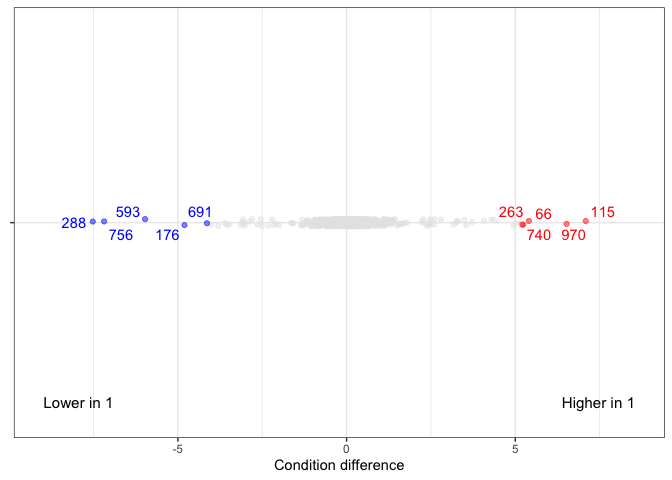

scDist: Robust identification of perturbed cell types in single-cell
RNA-seq data
================
R package version 0.1.0

## Installation

From the R console, `devtools::install_github("phillipnicol/scDist")`.

## Demo

``` r
library(scDist)
set.seed(1126490984)
```

Generate simulated normalized counts with a distance (separation) $D$
and patient-specific effect $\tau$:

``` r
simCellType <- function(D,tau,nn=100,G=1000,N1=5,N2=5,J=30,label="A") {
  beta_true <- rep(0,G)
  beta_true[sample(1:G,size=nn)] <- uniformly::runif_on_sphere(n=1,d=nn,r=D)[1,]
  y <- matrix(0, nrow=(N1+N2)*J,ncol=G)
  for(i in 1:G) {
    cntr <- 1
    for(j in 1:N1) {
      omega <- rnorm(1,mean=0,sd=tau)
      y[cntr:(cntr+J-1),i] <- omega+rnorm(J)
      cntr <- cntr+J
    }
    for(j in 1:N2) {
      omega <- rnorm(1,mean=0, sd=tau)
      y[cntr:(cntr+J-1),i] <- beta_true[i]+omega+rnorm(J)
      cntr <- cntr+J
    }
  }
  
  response <- rep(0,(N1+N2)*J)
  response[1:(N1*J)] <- 1

  samples <- c()
  for(i in 1:(N1+N2)) {
    samples <- c(samples, rep(i,J))
  }

  meta.data <- data.frame(response=response,patient=as.factor(samples),clusters=label)
  out <- list()
  out$Y <- t(y); out$meta.data <- meta.data
  return(out)
}

simData <- function(nct=10, J=50, N1, N2, G=1000, nn=100,tau=0.5) {
  Y <- matrix(0,nrow=G,ncol=0)
  meta.data <- data.frame(response=NULL,
                          patient=NULL,
                          clusters=NULL)
  D.true <- rep(0,nct)
  for(i in 1:nct) {
    D.true[i] <- rexp(n=1,rate=0.05)
    out <- simCellType(D=D.true[i],J=rpois(n=1,lambda=J),N1=N1,N2=N2,label=letters[i],tau=tau)
    Y <- cbind(Y,out$Y)
    meta.data <- rbind(meta.data,out$meta.data)
  }
  
  out$Y <- Y
  out$meta.data <- meta.data
  out$D.true <- D.true
  return(out)
}

data <- simData(N1=5,N2=5)
```

The `meta.data` data frame contains the assignment of each cell to
condition, patient, and cell type:

``` r
head(data$meta.data)
```

    ##   response patient clusters
    ## 1        1       1        a
    ## 2        1       1        a
    ## 3        1       1        a
    ## 4        1       1        a
    ## 5        1       1        a
    ## 6        1       1        a

Now we apply scDist:

``` r
out <- scDist(data$Y,data$meta.data,fixed.effects = "response",
              random.effects="patient",
              clusters="clusters")
```

    ## ================================================================================

The results data frame gives a summary of the estimated distance and
uncertainty for each cell type

``` r
out$results
```

    ##        Dist. 95% CI (low) 95% CI (upper)        p.val
    ## a 33.1170604     32.81025       33.43637 0.0000099999
    ## b 35.3899802     34.56483       36.21945 0.0000099999
    ## c 55.3987167     54.60078       56.18250 0.0000099999
    ## d 27.9655613     27.11987       28.81834 0.0000099999
    ## e 24.4181848     23.71274       25.18280 0.0000099999
    ## f  0.2559488      0.00000       10.32550 0.8552714473
    ## g 12.7894179     10.23381       15.39499 0.0003399966
    ## h 61.4462535     60.62555       62.27115 0.0000099999
    ## i 13.2704969     12.28885       14.36900 0.0000099999
    ## j 33.7676139     32.74384       34.77246 0.0000099999

The true distances are

``` r
names(data$D.true) <- letters[1:length(data$D.true)]
data$D.true
```

    ##         a         b         c         d         e         f         g         h 
    ## 31.497609 33.241530 55.007071 26.022257 22.628022  1.772227  7.941455 59.985757 
    ##         i         j 
    ##  8.047332 32.273485

We can also plot the results

``` r
DistPlot(out)
```

<!-- -->
